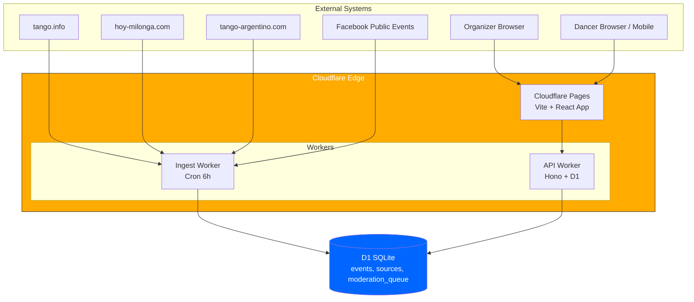
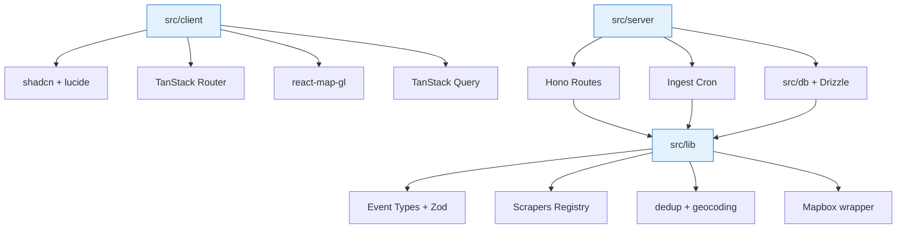
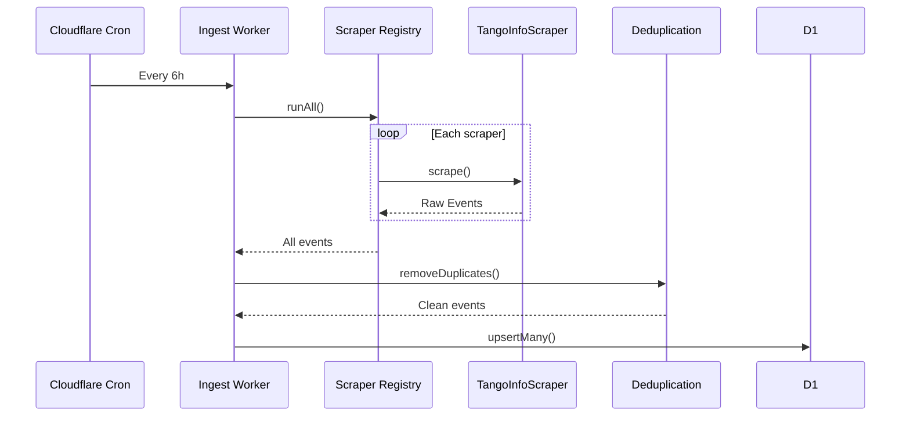
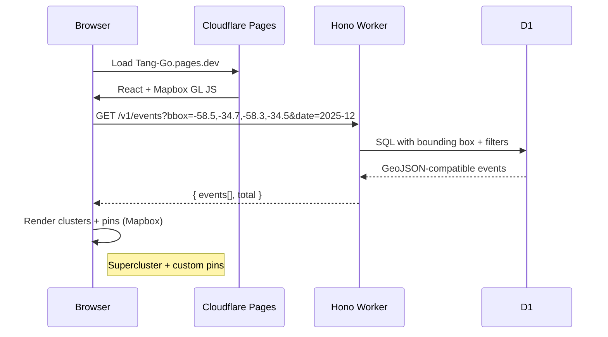
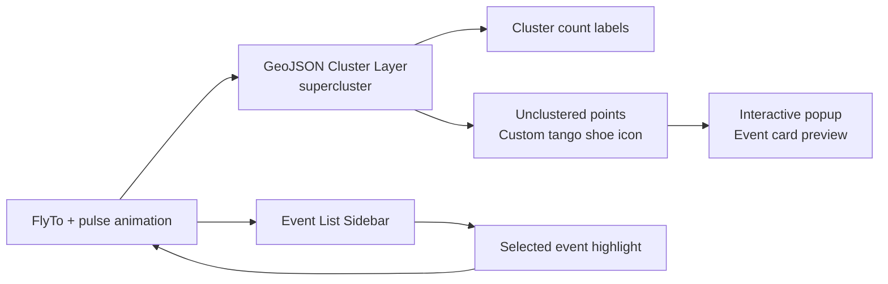
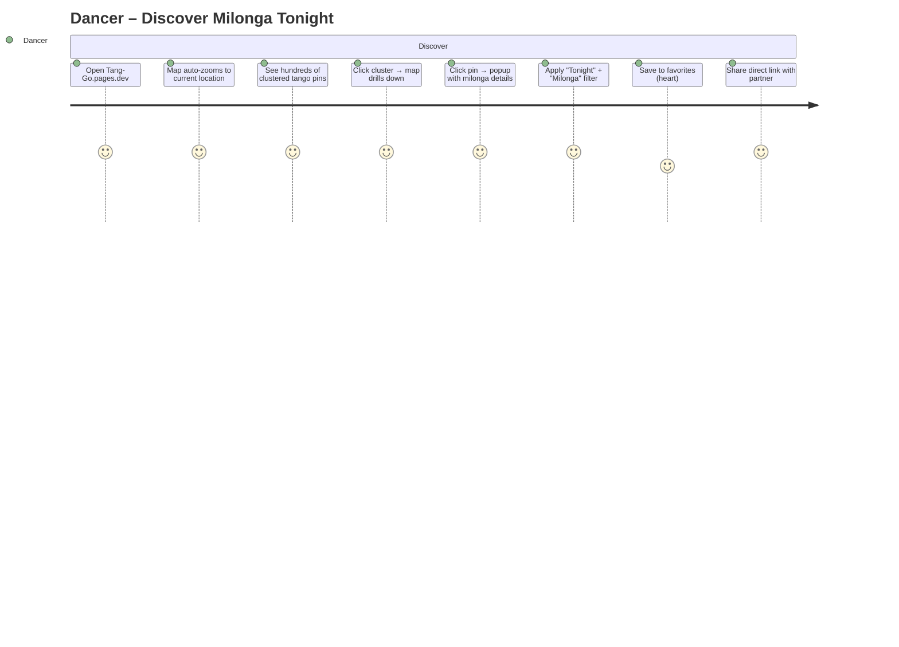
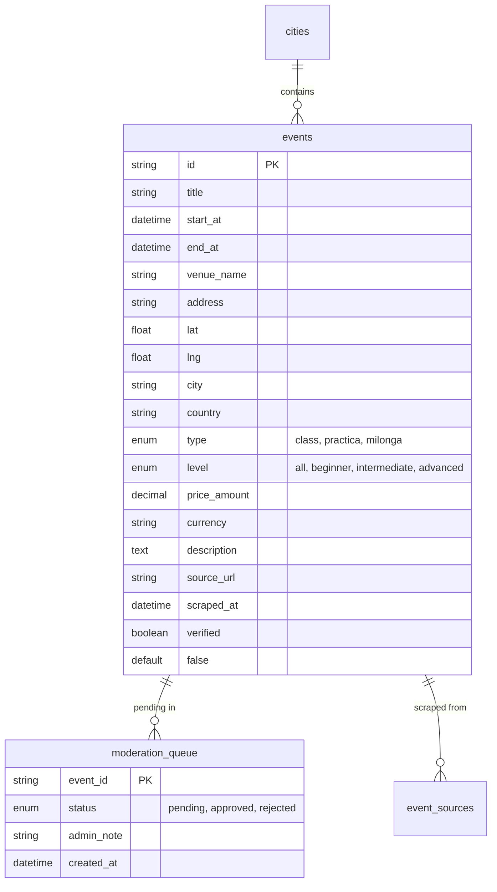
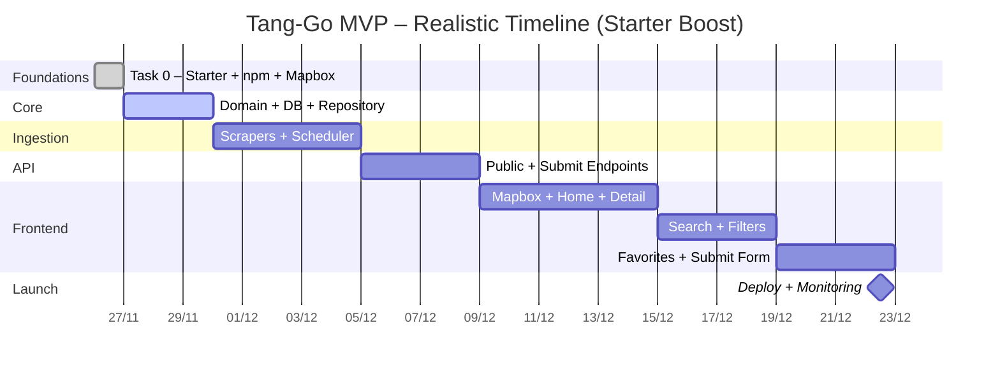

# Tang-Go – Complete System Diagrams
Updated for: tang-go-app starter + npm + Mapbox GL JS

## 1. High-Level Architecture (C4 – Level 2)

## 2. Updated Package & Module Boundaries (Single Repo – tang-go-app style)

## 3. Event Ingestion Pipeline (unchanged logic)

## 4. Frontend → API Flow with Mapbox

## 5. Mapbox GL JS Layer Stack

## 6. MVP User Journey – Dancer (Mapbox focus)

## 7. Updated Data Model (ERD)

## 8. Development Timeline (Realistic with Starter)

